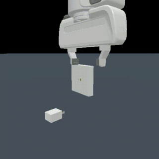
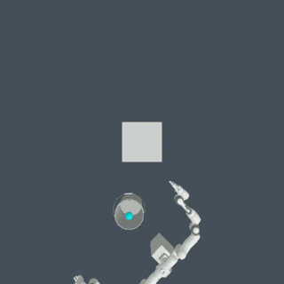
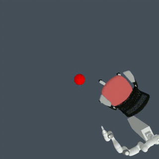
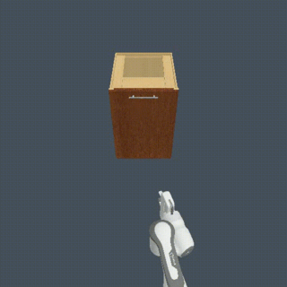
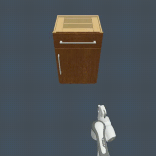

## 🌟RGMP-S: Recurrent Geometric-prior Multimodal Policy for Generalizable Humanoid Robot Manipulation 🤖✨
#### An end-to-end framework that unifies geometric-semantic skill reasoning with data-efficient visuomotor control using RASNet (Recursive Adaptive Spiking Network) ([Paper and Appendix](https://arxiv.org/pdf/2511.09141))
### 🤝 Human-Robot Interaction Videos 🎥
#### 👀 For the full video with sound, please refer to this [link](https://github.com/user-attachments/assets/5c396c4f-d024-41cc-aa6f-935461931ff5). 

|     **Huamn-robot interaction**     | 
| :---------------------------------: | 
|  |

|     **Generalization ability**      | 
| :---------------------------------: | 
|  |

### ⏳ Long-horizon Manipulation Tasks 🚀

|                Towel folding                 |                 Pouring water              |                Bin picking             |
| :---------------------------------: | :------------------------------: | :--------------------------------: |
|  |  |  |

### 🔥 RGMP-S Generalization Performance in Maniskill2 Simulator 🚀

|               PlugCharger                 |                MoveBucket              |               PushChair             |              OpenCabinetDoor               |               OpenCabinetDrawer              | 
| :---------------------------------: | :------------------------------: | :--------------------------------: | :------------------------------: | :------------------------------: |
|  |  |  | | | 


### 🛠️ Installation Instructions 🚀
### 🔧 Step-by-step Setup
```py
Create and activate a Conda environment
conda create -n GSNet python=3.7 -y
conda activate GSNet
```
Install dependencies
#### Install PyTorch
```py
conda install pytorch==1.8.0 torchvision==0.9.0 cudatoolkit=10.2 -c pytorch
```
### Install additional requirements
```py
pip install timm==0.4.12
pip install opencv-python==4.4.0.46 termcolor==1.1.0 yacs==0.1.8 pyyaml scipy
pip install -r requirement.txt
```

### 🧠 Skill Library
```py
The framework supports three core manipulation skills with geometric prior integration:
side_grasp(): Optimized for cylindrical objects (cans, bottles) - performs stable lateral grasping
lift_up(): Specialized for crushed/flat objects - executes overhead lifting in cluttered environments with obstacle avoidance
top_pinch(): Designed for small/thin objects (napkins, cables) - enables precise pinch grasping with fine motor control

The skills are powered by RASNet (Recursive Adaptive Spiking Network) with DenseNet blocks and adaptive spiking neurons for enhanced spatial-temporal reasoning.
```
### 📂 File Structure
```py
Humanoid/
├── lgss_framework.py         # Core LGSS (Language-Guided Skill Selection) framework implementation
├── yolo_segmentation.py      # YOLOv8-based object segmentation module
├── skill_library.py          # Robot manipulation skill execution logic
├── handler_chat.py           # Natural language interaction handler with RGMP integration
├── handler_api.py            # Qwen-vl visual-language API interface
├── handler_camera.py         # Real-time camera input processing module
├── handler_speech.py         # Speech recognition and synthesis handler
├── prompts.py                # Prompt templates for multimodal policy guidance
├── main.py                   # Main application entry point
├── skill_train.py            # RASNet model training script
├── RASNet.py                 # Recursive Adaptive Spiking Network with DenseNet blocks
├── rgmp-s_framework.py       # Main RGMP-S framework integrating LGSS and RASNet
└── requirements.txt          # Project dependencies
```

### ⚙️ Configuration

Update configs.yaml with your API credentials:
```py
qwen:
  model_name: "qwen-vl-max-latest"
  api_key: "your_qwen_api_key"
```

### 🏋️ Training
To train custom RASNet models for specific manipulation skills:
```py
python skill_train.py --train_folder ./dataset/train/ --valid_folder ./dataset/valid/
```

### 💻 Hardware Requirements
GPU: NVIDIA GPU (RTX 4090 recommended for optimal performance)

VRAM: Minimum 8GB (16GB+ preferred for real-time inference)

Sensors: USB camera (1080p+) for visual input; Audio I/O devices for speech interaction

Robot Platform: Compatible with humanoid manipulators supporting ROS control interface

### 🔌 API Integration
The framework integrates with state-of-the-art AI services:

Qwen-vl API: For multimodal visual-language understanding and decision making

YOLOv8: For real-time object detection and instance segmentation

### 🧪 Maniskill2 Simulator Setup
#### Install base simulator
```py
pip install mani-skill2
cd maniSkill2-Learn
```
#### Install PyTorch compatible with simulator
```py
conda install pytorch==1.11.0 torchvision==0.12.0 cudatoolkit=11.3 -c pytorch
pip install pytorch3d
pip install ninja
pip install -e .
pip install protobuf==3.19.0

# Configure asset directory
ln -s ../ManiSkill2/data data  # Link asset directory
# Alternatively: export MS2_ASSET_DIR={path_to_maniskill2}/data
```

#### 🔧 SparseConvNet Support (for 3D manipulation)
##### Install dependencies
```py
sudo apt-get install libsparsehash-dev  # For Ubuntu; use `brew install google-sparsehash` for macOS
```

#### Install modified torchsparse
```py
pip install torchsparse@git+https://github.com/lz1oceani/torchsparse.git
```

#### 🚀 Deployment Workflow
```py
#1. Convert Demonstrations (Controller Setup)
python -m mani_skill2.trajectory.replay_trajectory \
--traj-path demos/rigid_body/PegInsertionSide-v0/trajectory.h5 \
--save-traj --target-control-mode pd_ee_delta_pose \
--obs-mode none --num-procs 32

#2. Configure Observation Mode
# Replace {ENV_NAME}, {PATH}, and {YOUR_DIR} with actual values
python tools/convert_state.py --env-name {ENV_NAME} --num-procs 1 \
--traj-name {PATH}/trajectory.none.pd_joint_delta_pos.h5 \
--json-name {PATH}/trajectory.none.pd_joint_delta_pos.json \
--output-name {PATH}/trajectory.none.pd_joint_delta_pos_pcd.h5 \
--control-mode pd_joint_delta_pos --max-num-traj -1 --obs-mode pointcloud \
--n-points 1200 --obs-frame base --reward-mode dense --render

#3. Run Environment-Specific Evaluation (Example: MoveBucket)
python maniskill2_learn/apis/run_rl.py configs/brl/bc/pointnet_soft_body.py --work-dir {YOUR_DIR} --gpu-ids 0 --cfg-options \
"env_cfg.env_name=Movebucket" "env_cfg.obs_mode=pointcloud" "env_cfg.n_points=1200" "eval_cfg.num=100" "eval_cfg.save_traj=False" \
"eval_cfg.save_video=True" "eval_cfg.num_procs=10" "env_cfg.control_mode=pd_ee_delta_pose" \
"replay_cfg.buffer_filenames={YOUR_PATH}/trajectory.none.pd_ee_delta_pose_pointcloud.h5" "env_cfg.obs_frame=ee" \
"train_cfg.n_checkpoint=10000" "replay_cfg.capacity=10000" "replay_cfg.num_samples=-1" "replay_cfg.cache_size=1000" "train_cfg.n_updates=500"
```

📜 License
This project is intended for research purposes only. Please cite our paper if you use this framework in academic work.


